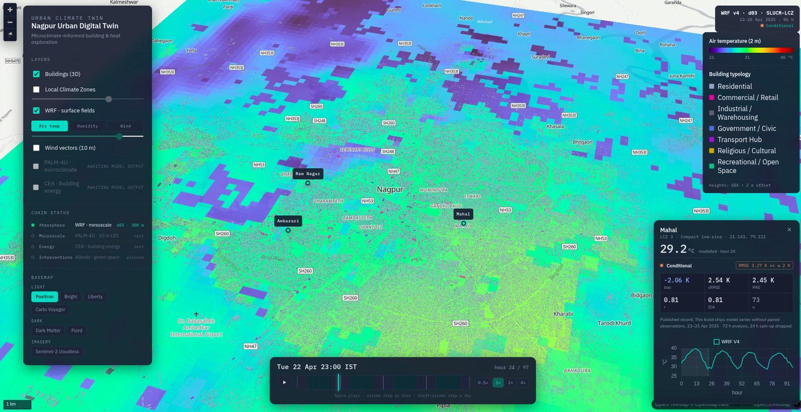
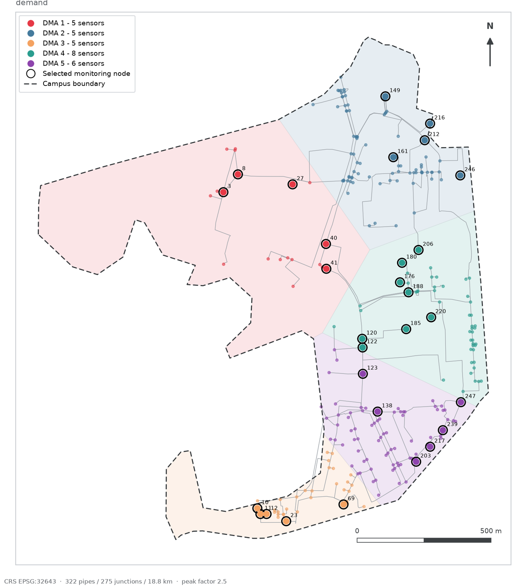

::: {.hero}

::: {.hero-cue}
[Open the Nagpur viewer](https://manish-bilore.github.io/urban-climate/) 859,488
buildings, the LCZ map and 96 h of WRF fields, in the browser. About 90 MB, so it
loads on click.
:::
:::

::: {.lede}
I build simulations of Indian cities, of air, heat, and water; and the records
that show how closely those simulations correspond to what was actually measured.
:::

Architecture, then computation, then geoinformatics: a room, a building, a city.

I am a Program Associate at [iFOREST](https://iforest.global/) in Delhi, working
across the WRF to PALM-4U to CEA chain for Digital Urban Climate Twins for Indian
cities.

I hold an M.Tech in Geoinformatics from CSRE, IIT Bombay, and an MA in
Computation in Architecture from the Royal Danish Academy, Copenhagen.

A microclimate model becomes a claim about people the moment someone acts on it.
That makes validation part of the model, not an afterthought. Each project here
therefore carries its own error record: what was compared, against what, how well
the method performed, and where it fails.

## What I work on

- **Urban climate simulation:** WRF, PALM-4U large-eddy simulation, urban canopy schemes, LCZ mapping, and heat-risk analysis
- **Geospatial computation:** large-scale building footprints, GIS pipelines, spatial databases, and satellite time series
- **Digital twins:** coupled simulation, 3D city models, infrastructure networks, and browser-based visualisation
- **Semantic infrastructure:** ontology design, knowledge graphs, and interoperability across data sources
- **Computational design:** parametric modelling, CFD, environmental analysis, and architecture

## Research interests

I am looking for a PhD position in urban climate or boundary-layer meteorology,
and am open to research roles in climate modelling, urban environmental
simulation, and geospatial engineering.

## Recent work

::: {.p-card}
::: {.p-thumb}

:::
::: {.p-body}
[**Nagpur Digital Urban Climate Twin**](https://manish-bilore.github.io/nagpur-duct-site/){.p-name}

- 859,488 building footprints and 96 hours of WRF fields, in the browser
- WRF-ARW on 7.5/1.5/0.3 km nests, PALM-4U at 10 m, CEA stock model for cooling demand
- [The validation record](https://manish-bilore.github.io/nagpur-duct-site/validation.html): 2 m air temperature against station observation, and what each configuration change bought
:::
:::

::: {.p-card}
::: {.p-thumb}

:::
::: {.p-body}
[**Ontology-driven water distribution twin**](https://manish-bilore.github.io/wdn-digital-twin/){.p-name}

- An IIT Bombay campus network, from an estate-office CAD drawing to a graph you can question
- 322 pipes, 18.8 km of main, 29 monitoring nodes, 8,554 triples
- EPANET 2.2 hydraulics, K-means district metering, OWL 2 DL ontology, SPARQL running client-side
:::
:::

[All work](projects.qmd)

## Contact

[manish.bilore@gmail.com](mailto:manish.bilore@gmail.com) ·
[GitHub](https://github.com/Manish-Bilore) ·
[LinkedIn](https://www.linkedin.com/in/manish-b-44212084/) ·
[CV](cv.qmd)
