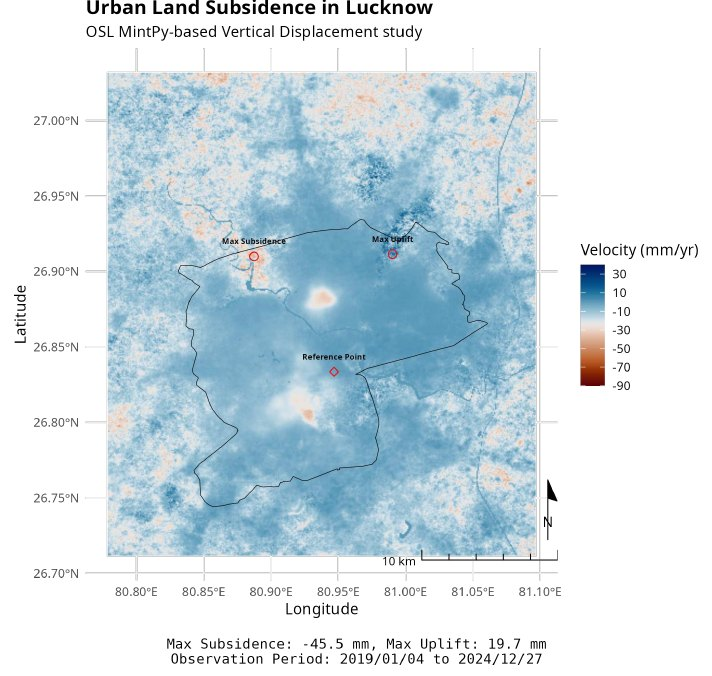
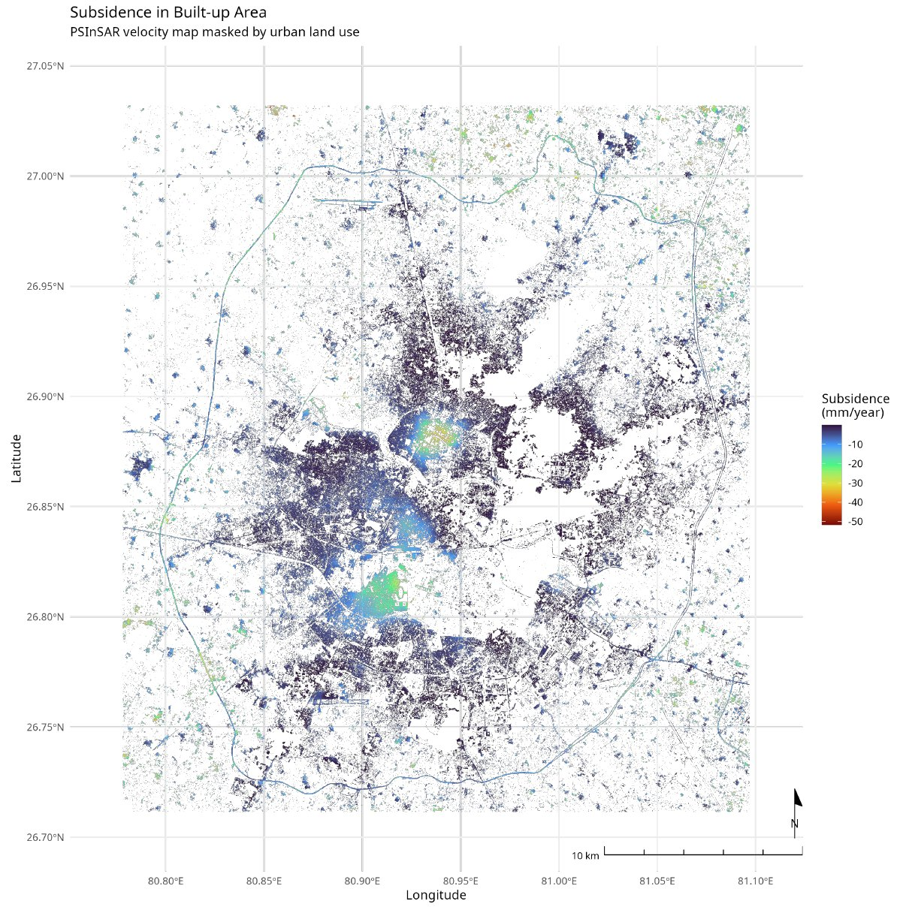
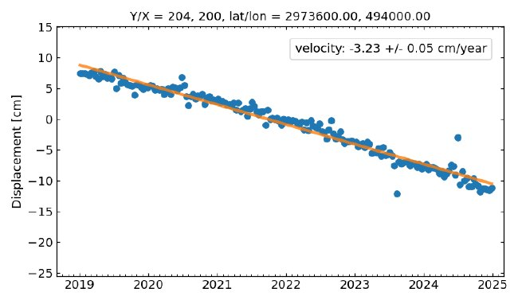
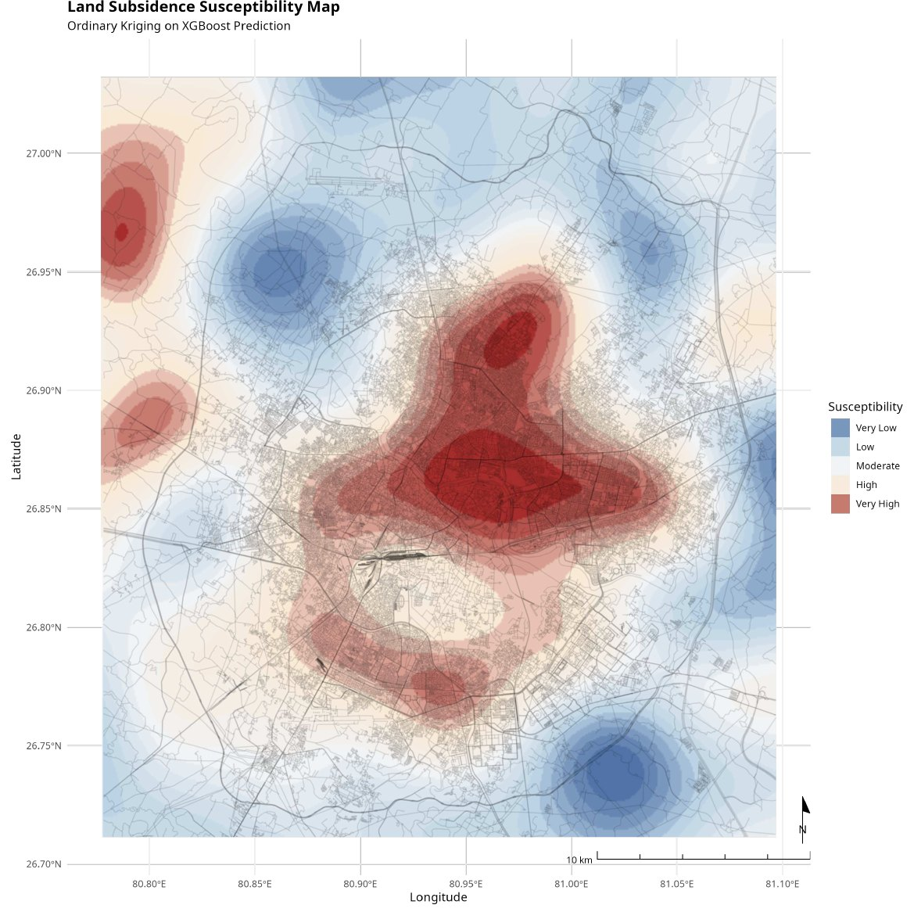
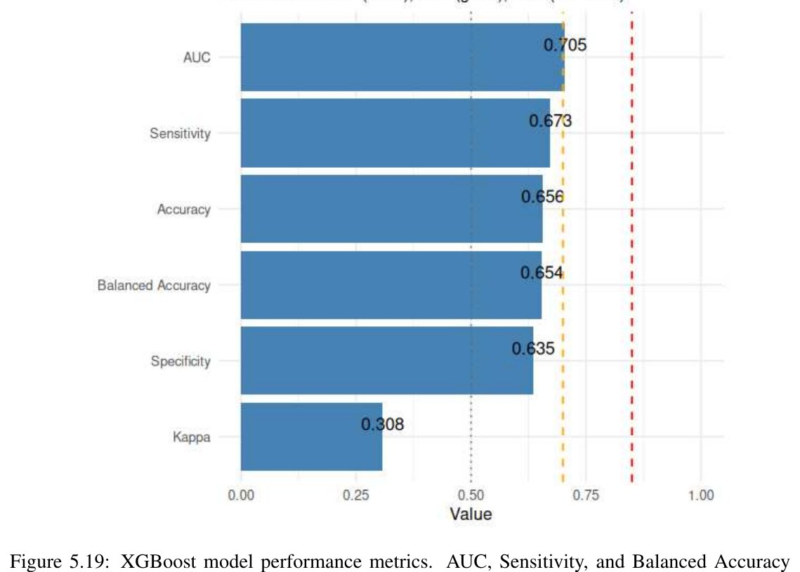

::: {.project-links}
[Read the thesis (PDF)](../files/ManishBilore-MTech-InSAR-subsidence.pdf){.btn .btn-primary}
:::

M.Tech thesis, Centre of Studies in Resources Engineering, IIT Bombay, supervised
by Prof. Y. S. Rao. Submitted June 2025.

A subsidence map is a processing decision as much as a measurement. Two
open-source time-series chains, run on the same Sentinel-1 frame, will not return
the same numbers, they build different interferogram networks, correct the
atmosphere with different models, and pick their own reference point. This work
runs both over Lucknow, quantifies where they part company, and then uses the
result to train a susceptibility model for the parts of the city that have no
scatterers to measure.

::: {.facts}

2019–2024

Sentinel-1 stack

−63.9 mm/yr

peak rate, peri-urban Lucknow

−3.23 cm/yr

at the fastest scatterer

5

cities mapped

:::

## Two chains, one frame

**MintPy on OpenSARLab.** Sentinel-1 IW SLC, VV, processed to interferograms
through ASF HyP3 and inverted with the small-baseline workflow on the Alaska
Satellite Facility's cloud JupyterHub. Tropospheric delay corrected with ERA5
reanalysis pulled from the Copernicus Climate Data Store; network optimisation,
ramp correction and velocity estimation follow, with the reference pixel placed on
stable ground.

**LiCSBAS on LiCSAR.** The same frame, taken from pre-processed COMET-LiCS
interferograms, inverted with loop-closure-screened SBAS and corrected with GACOS
rather than ERA5, on a 90 m grid.

A single-pair DInSAR run in SNAP (2024-12-03 / 2024-12-27, 24-day baseline,
descending) sits in front of both as a baseline. Its fringes over the urban core
are coherent enough to see, and uncorrected enough that the thesis treats it as a
qualitative indicator only, which is the argument for time series in the first
place.

## Where the two chains agree

They agree on **where**. The hotspots are in the same places, and they persist
against an independent StaMPS-based study of Lucknow covering 2014–2020, the
zones that were subsiding then are still subsiding now.

They disagree on **how much**. Reference points are auto-selected independently
and do not coincide, so the two velocity fields carry different offsets. LiCSBAS
masks harder and returns a sparser, higher-confidence field; MintPy retains
moderate-noise pixels through phase bridging and returns broader coverage. GACOS
and ERA5 remove different noise components. For Mumbai, LiCSBAS returned nothing
usable at all across the selected frames, so that city rests on one chain only.

The practical reading: the spatial pattern is robust to the choice of chain, the
absolute rate is not. Anything downstream should be built on the pattern.

## From measurement to susceptibility

Persistent scatterers only exist where something reflects stably. To say anything
about the rest of the city, the deformation field has to become training data.
Velocities below −10 mm/yr label the positive class; predictors are terrain
attributes from SRTM (slope, elevation, curvature, aspect, TWI, SPI), a
random-forest land cover classification of Sentinel-2 (out-of-bag error 0.081),
and anthropogenic layers for road and construction density. Collinearity screened
by Pearson correlation and VIF. XGBoost beat random forest and SVM across the
metric set; its probability surface was interpolated by ordinary kriging under a
Gaussian variogram and cut into five zones.

::: {layout-ncol=2}

:::

AUC 0.705, balanced accuracy 0.654, sensitivity 0.673, specificity 0.635, kappa
0.308. Moderate, and reported as moderate.

## Limitations

**LOS is not vertical.** Every rate here is line-of-sight. Converting to vertical
motion assumes horizontal displacement is negligible, which in a groundwater-driven
setting is defensible and still an assumption.

**Everything is relative to a reference pixel.** Both chains measure deformation
against a point assumed stable. If that point moves, the whole field shifts with
it.

**The susceptibility surface is an interpolated model output, not an observation.**
Kriging an XGBoost probability produces something smooth and readable that no
instrument ever measured. It should be read as a ranking of relative
susceptibility.

**Land cover dominates the model.** In the gain decomposition, the land-cover
predictor carries the large majority of the model's explanatory weight, with slope
a distant second. That is close to saying the classifier has learnt where the
built-up area is, which is also where the labels come from, since scatterers are
concentrated there. Breaking that circularity needs predictors the InSAR product
does not already encode: groundwater levels, soil profile, subsurface geology.
