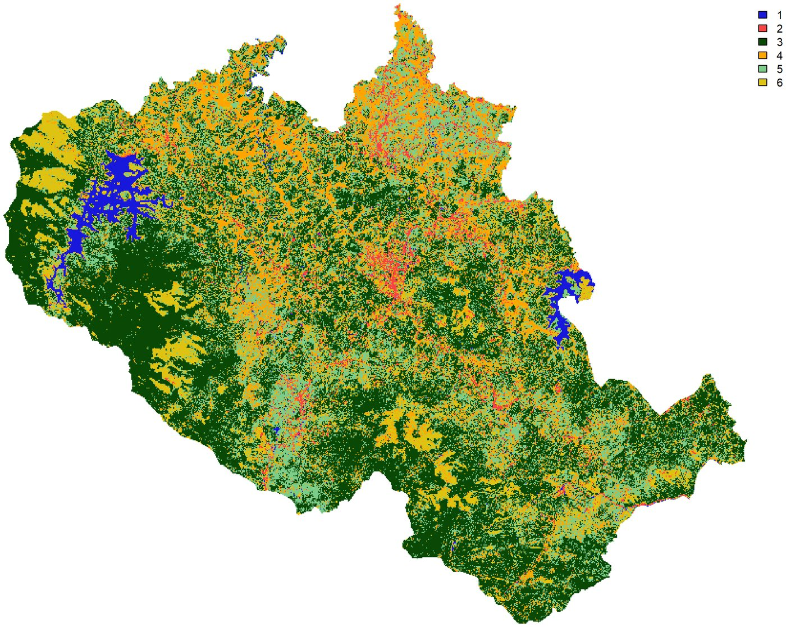

::: {.project-links}
[Repository](https://github.com/Manish-Bilore/GNR-627-Predictive-Modelling-Landslide-Project){.btn .btn-primary}
:::

Predictive mapping of landslide-prone terrain in a district where the training
inventory is thin and the consequences of a false negative are not symmetric
with those of a false positive.

## Approach

Twelve conditioning parameters are assembled in R, then combined in a
fuzzy inference system rather than a purely data-driven classifier. The choice
is deliberate: where the landslide inventory is small, a rule base that a
geomorphologist can read and argue with is worth more than a marginal gain in
fitted accuracy from a model that cannot be interrogated.

| Stage | What it produces | Script |
|---|---|---|
| Land cover | Random-forest classification of Sentinel-2 | `01_LULC_RF.Rmd` |
| Vegetation | NDVI as a separate continuous conditioning layer | `02_NDVI.Rmd` |
| Terrain | Slope, aspect and curvature from the Cartosat DEM | `03_Cartosat_DEM.Rmd` |
| Assembly | Parameter stack, unnormalised, as the FIS input frame | `04_Dataframe_Generation.Rmd` |
| Inference | Membership functions and rule base over the stack | `05_FuzzyInference.R` |

## Where it goes next

The fuzzy system is the baseline for a comparison rather than the end of the
work: ANFIS, then neural and ensemble approaches over the same parameter stack,
so that differences between models can be attributed to the model and not to
the inputs. The reference method is [this *Computers & Geosciences* paper
(2020)](https://doi.org/10.1016/j.cageo.2020.104592). ⟨Replace with the full
citation before publishing the page.⟩

## Limitations

The inventory constrains everything downstream. Membership functions are set
from the literature and from terrain reasoning rather than fitted, so the map
should be read as a ranking of relative susceptibility, not as a probability.
