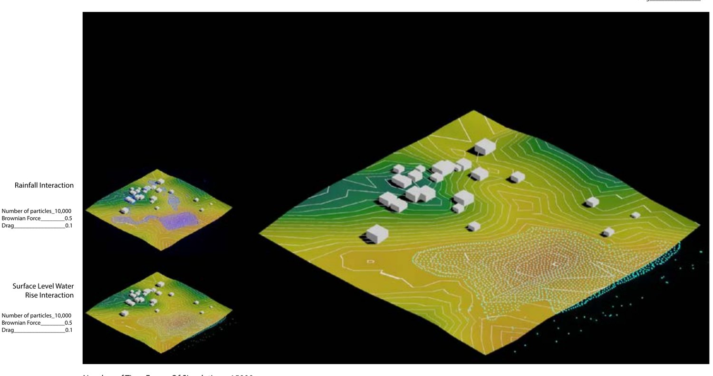
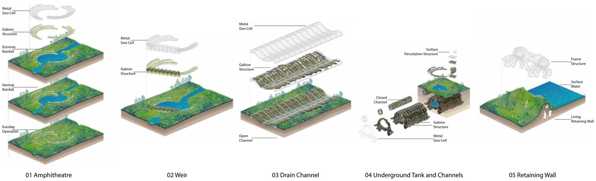
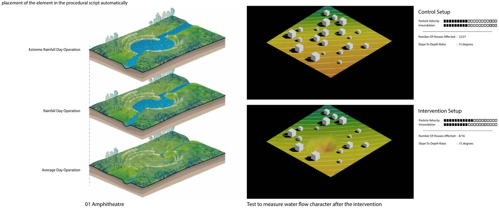
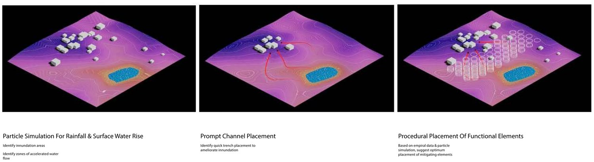
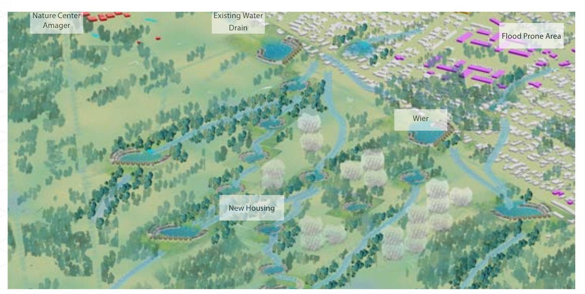

::: {.project-links}
[Project at the Royal Danish Academy](https://royaldanishacademy.com/en/node/4661){.btn .btn-primary}
[Read the thesis (PDF)](../files/ManishBilore-MA-surface-runoff.pdf){.btn .btn-outline-secondary}
:::

MA thesis, Computation in Architecture, CITA studio, Royal Danish Academy,
Copenhagen. Tutored by Tom Svilans, Spring 2021. Sited on Amager and Tårnby,
south of Copenhagen.

Flood design usually runs one way: a designer proposes a landscape, then a model
checks it. This inverts the order. Particle simulation of rainfall and surface
water rise runs first, over the terrain as it is; the inundation and
accelerated-flow zones it exposes become the prompt, and a procedural script
places mitigating elements against them. The design is an output of the water
rather than a hypothesis submitted to it.

::: {.facts}

100,000

particles, extreme rainfall run

15,000

simulation time steps

3

chained analysis tools

5

catalogued interventions

:::

## Three tools in a loop

**Landscape analysis** derives contour, slope and watershed structure from the
site terrain, and reports cut-and-fill volumes for any proposed change, so the
earthwork cost of a move is visible while the move is being made.

**Water analysis** runs meshless particle simulation across that terrain —
particle flow, speed, and concavity against slope — for two loading cases:
rainfall landing on the surface, and water rising through it. The combined run
carries 20,000 particles at a Brownian force of 0.5 and drag of 0.1.

**Program generation** takes the fluid vectors and site context and voxelises a
layout: circulation, access and blue–green space allotment placed against where
the water actually goes.

## Grading the interventions

The procedural script needs to know what each element is worth before it can
place it. So each intervention was simulated twice on the same terrain at the
same slope-to-depth ratio — once bare as a control, once with the element in
place — and graded on particle velocity and inundation extent.

Five elements came out of that, each drawn as an assembly of metal geocell,
gabion and channel rather than as a shape: a flood-able amphitheatre park, a
weir, an open/closed drain channel, an underground tank, and a living retaining
wall. Each is meant to read as public amenity on a dry day and as hydraulic
infrastructure on a wet one — the amphitheatre holds an everyday, a
normal-rainfall and an extreme-rainfall state, and stays a park in all three.

## From prompt to plan

A separate experiment series swept the parameter space behind that placement:
four modification patterns at a 15% slope gradient, under cut and under fill,
against two fluid types — 250 particles standing for a flash flood, 1,000 for
continuous rainfall — over 500 time frames each. The question was which patterns
of landscape change collect water and which merely move it somewhere else.

Scaled up to Tårnby, the same loop marks the flood-prone blocks, separates the
area affected by inundation from the area worth redeveloping, and proposes a
porous urban form: integrated wetlands, distributed holding ponds and water
channels threaded between new housing.

Alongside it sits a comparative study of flood tactics in Copenhagen, Mumbai,
Hong Kong, Miami, New York and Oslo, separating the tactics that generalise
across coastal cities from the ones that belong to one.

## Limitations

**The particle model is a design instrument, not a hydraulic one.** It is
meshless and unvalidated against gauge data. It produces plausible flow structure
and relative comparisons between options, not depths or discharges, and nothing
here should be read as a design flood.

**No return periods.** "Normal" and "extreme" rainfall are particle counts —
10,000 and 100,000 — not recurrence intervals. Tying those loading cases to
Danish design rainfall statistics is the first thing this would need to be
operational.

**Intervention grades are relative and single-site.** Each element is scored
against one control terrain at one slope-to-depth ratio, so the grades order the
catalogue rather than predict performance elsewhere.

## Where it went

This is the earliest work on this site and the origin of most of what follows.
The chain here — terrain, simulation, a control to test against, then
intervention — is the one I now run with WRF and PALM-4U instead of particles,
over cities instead of blocks, and against station observations instead of a
bare-terrain run.
